<p align="center">
  
</p>

<h1 align="center">Screen Translate</h1>

<p align="center">
  <strong>Point. Tap. Understand.</strong><br>
  <em>Instantly translate any text on your Android screen — right where it appears.</em>
</p>

<p align="center">
  <a href="https://play.google.com/store/apps/details?id=com.galaxy.airviewdictionary">
    
  </a>&nbsp;
  &nbsp;
  
</p>

<p align="center">
  <a href="https://play.google.com/store/apps/details?id=com.galaxy.airviewdictionary">
    
  </a>
</p>

---

## The Problem

You're reading a webpage in Japanese. Or watching a Korean drama without subtitles. Or trying to use a Chinese app. Every time, you have to:

1. Long-press the text (if you even can)
2. Copy it
3. Switch to a translator app
4. Paste it
5. Read the translation
6. Switch back

**What if you could just... point at it?**

---

## How It Works

Screen Translate floats on top of whatever you're doing. Just drag the pointer to any text, and the translation appears instantly — like magic.

<table>
  <tr>
    <td align="center" width="50%">
      <strong>Word Mode</strong><br>
      <em>Tap any word for instant translation</em><br><br>
      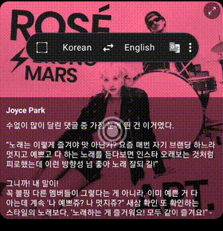
    </td>
    <td align="center" width="50%">
      <strong>Sentence Mode</strong><br>
      <em>Auto-detects and translates full sentences</em><br><br>
      
    </td>
  </tr>
  <tr>
    <td align="center">
      <strong>Paragraph Mode</strong><br>
      <em>Translates entire blocks of text at once</em><br><br>
      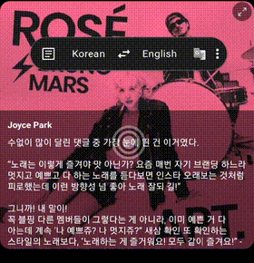
    </td>
    <td align="center">
      <strong>Selection Mode</strong><br>
      <em>Draw a box around exactly what you need</em><br><br>
      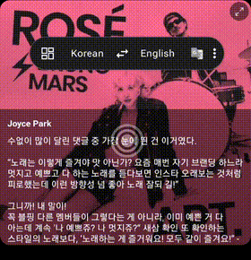
    </td>
  </tr>
</table>

---

## Works Everywhere

<p align="center">
  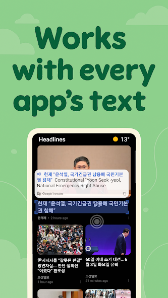
  &nbsp;&nbsp;
  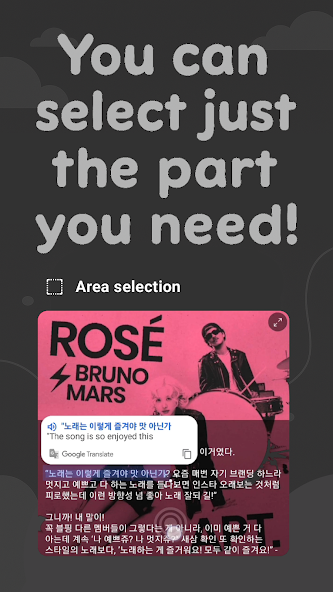
  &nbsp;&nbsp;
  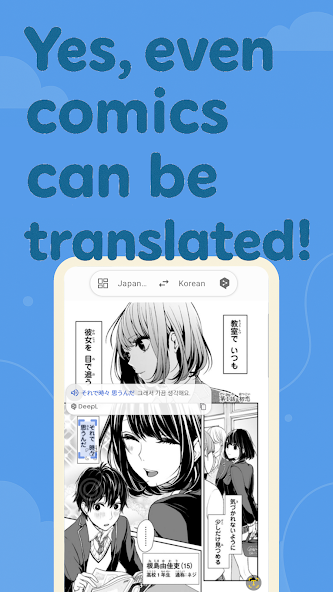
</p>

<p align="center">
  News apps, social media, games, manga, webtoons — if there's text on screen, it can be translated.
</p>

---

## Pick Your Translation Engine

<p align="center">
  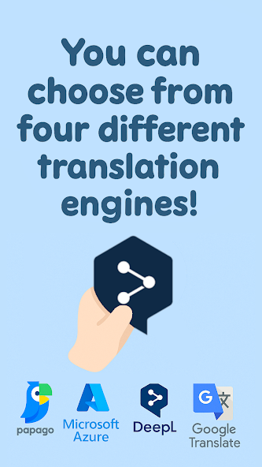
</p>

Not all translation engines are created equal. Screen Translate lets you switch between **four engines** to find the best one for your language pair:

<table>
  <tr>
    <td align="center" width="25%">
      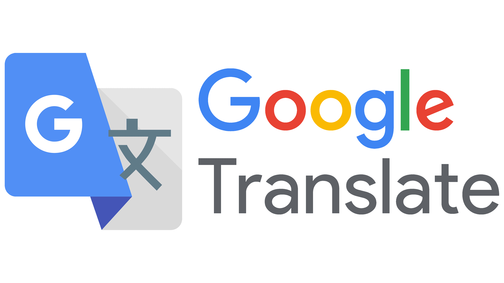<br><br>
      <strong>Google Translate</strong><br>
      <sub>The all-rounder. Fast, free,<br>and covers 146+ languages.</sub>
    </td>
    <td align="center" width="25%">
      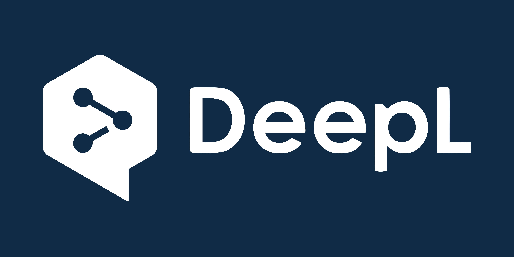<br><br>
      <strong>DeepL</strong><br>
      <sub>Natural, human-sounding<br>translations. Best for European languages.</sub>
    </td>
    <td align="center" width="25%">
      <br><br>
      <strong>Azure Translator</strong><br>
      <sub>Microsoft's engine. Reliable<br>and accurate across languages.</sub>
    </td>
    <td align="center" width="25%">
      <br><br>
      <strong>Papago</strong><br>
      <sub>Naver's neural MT. Excels at<br>Korean, Japanese, and Chinese.</sub>
    </td>
  </tr>
</table>

---

## AI-Powered Accuracy

<p align="center">
  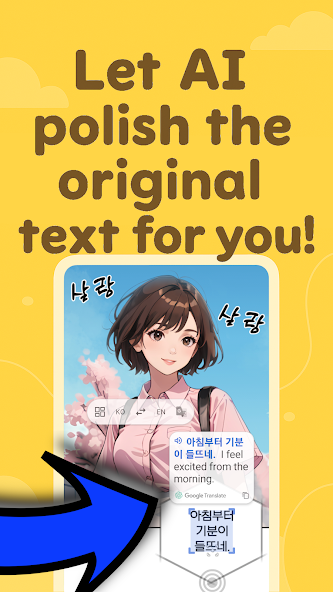
</p>

OCR isn't perfect — sometimes it misreads characters. Screen Translate uses **ChatGPT** to clean up OCR errors before translating, so you get accurate results even from messy text, handwriting, or stylized fonts.

---

## 130+ Languages

<p align="center">
  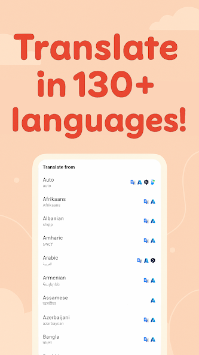
</p>

From Arabic to Zulu, from English to Japanese — translate between **130+ languages** with automatic source language detection. No need to manually set what language you're reading.

---

## Why I Built This

I live between languages every day, and existing solutions all required too many steps. I wanted something that just **works** — point at text, get the meaning. No context switching, no clipboard juggling.

Over time, it grew into a full-featured translation tool with multiple engines, AI correction, and smart text recognition. And now **over 1 million people** use it.

---

## Under the Hood

> *For the curious developers who want to peek inside.*

### How the magic happens

1. **Screen Capture** — Android's `MediaProjection` API continuously captures what's on your screen
2. **Text Recognition** — Google ML Kit runs **on-device OCR** to find and extract text from the captured frames
3. **Smart Grouping** — A custom algorithm clusters detected text into words, lines, sentences, or paragraphs based on position, spacing, and font size
4. **Translation** — The recognized text is sent to your chosen translation engine via REST APIs
5. **Overlay Rendering** — Results are displayed in a floating Compose UI overlay on top of your current app

All of this happens in **under a second**.

### Tech highlights

| | |
|---|---|
| **Kotlin + Jetpack Compose** | Modern Android UI with reactive state management |
| **Clean Architecture + MVVM** | Separation of concerns with ViewModels and Repositories |
| **Hilt** | Dependency injection for clean, testable code |
| **ML Kit** | On-device OCR for English, Chinese, Japanese, Korean, and Devanagari |
| **Multi-engine translation** | Google, DeepL, Azure, and Papago with smart routing |
| **Coroutines + StateFlow** | Smooth async operations without callback hell |
| **Firebase** | Analytics, Crashlytics, Remote Config, and Realtime Database |
| **Play Integrity API** | Security verification to prevent abuse |
| **MediaProjection** | Real-time screen capture with optimized frame streaming |

### Project structure

```
app/src/main/java/com/galaxy/airviewdictionary/
├── core/                  # OverlayService — the heart of the app
├── data/
│   ├── local/
│   │   ├── vision/        # OCR & text grouping algorithms
│   │   ├── capture/       # Screen capture via MediaProjection
│   │   ├── tts/           # Text-to-Speech
│   │   └── preference/    # User settings
│   └── remote/
│       ├── translation/   # Google, DeepL, Azure, Papago APIs
│       ├── ai/            # ChatGPT text correction
│       └── billing/       # Google Play Billing
├── ui/
│   ├── screen/
│   │   ├── overlay/       # Floating translation UI
│   │   ├── main/          # Settings screens
│   │   └── onboarding/    # First-time setup
│   └── common/            # Shared components
├── di/                    # Hilt dependency injection
└── extensions/            # Kotlin extension functions
```

---

## Building from Source

### What you need

- **Android Studio** (Ladybug or later)
- **JDK 17**
- **Android SDK 35**

### Steps

1. **Clone the repo**
   ```bash
   git clone https://github.com/AidanPark/src-screen-translator.git
   cd src-screen-translator
   ```

2. **Set up signing** — Edit `gradle.properties`:
   ```properties
   KEYSTORE_FILE=your-keystore.jks
   KEY_ALIAS=your-key-alias
   KEY_PASSWORD=your-key-password
   ```

3. **Add Firebase config** — Place your own `google-services.json` in the `app/` directory

4. **Build & Run**
   ```bash
   ./gradlew assembleDebug
   ```

> **Note:** You'll need your own API keys for translation services (Google, DeepL, Azure, Papago) and a Firebase project to run the full app. The OCR and on-device features work without any API keys.

---

## Permissions Explained

| Permission | What it does |
|-----------|-------------|
| **Display over other apps** | Shows the floating translation overlay |
| **Screen capture** | Reads text from your screen using OCR |
| **Internet** | Connects to translation APIs |
| **Vibration** | Gives haptic feedback when text is detected |
| **Notifications** | Required for the foreground service indicator |

---

## License

This project is provided for **educational and reference purposes**. See [LICENSE](LICENSE) for details.

---

<p align="center">
  <a href="https://play.google.com/store/apps/details?id=com.galaxy.airviewdictionary">
    
  </a>
  <br><br>
  <sub>Made with caffeine and curiosity.</sub>
</p>
